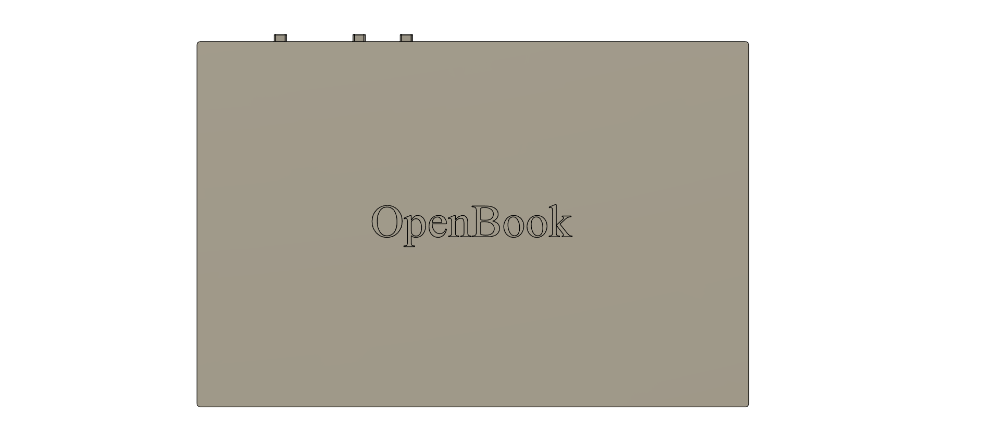
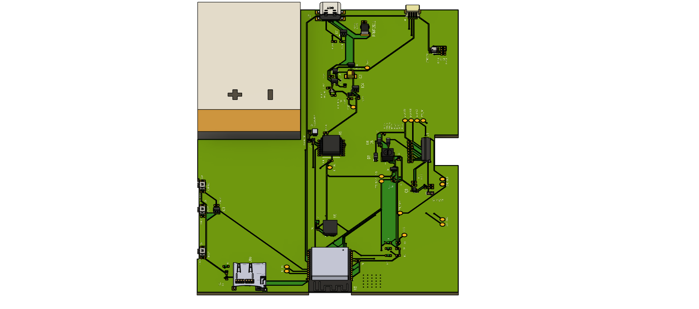
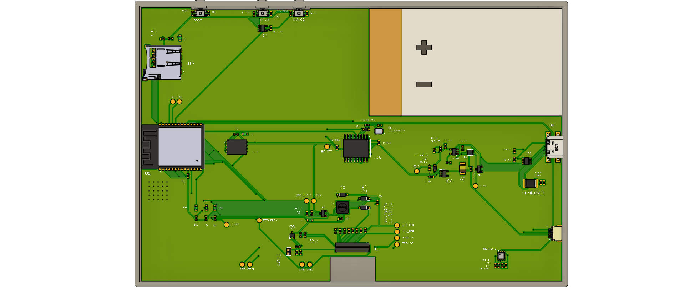
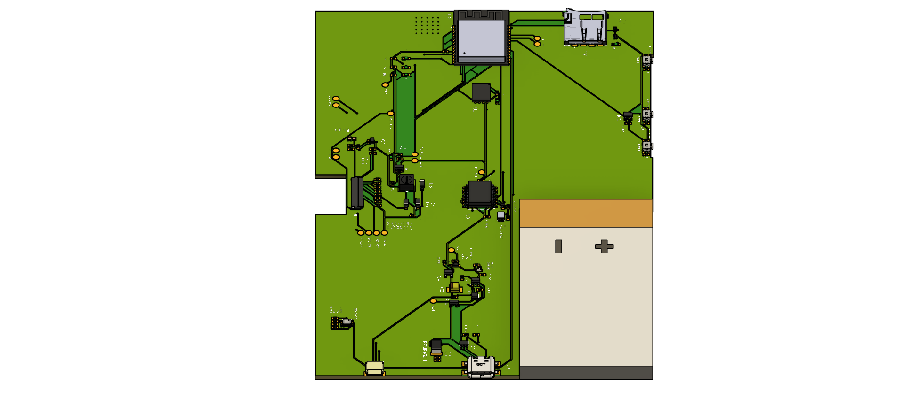
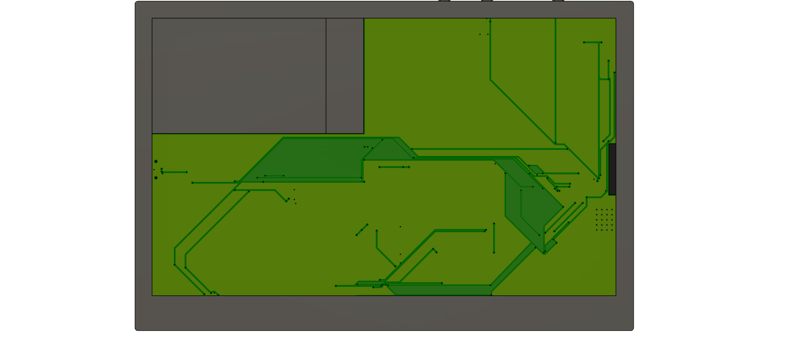
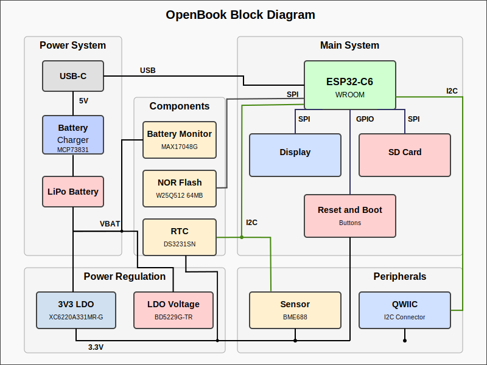

###### Copyright Radu Marin 2025
## README
# OpenBook

# Table of content

1. [Hardware details](#hardware-details)
2. [Design](#design)
3. [Diagram](#diagram)
4. [Bill of Materials](#bill-of-materials)

# Hardware details

OpenBook is an e-reader platform based on ESP32-C6 with E-Paper display technology. This document outlines the hardware architecture, component selection, and design considerations.

### Primary components:

**ESP32-C6 Microcontroller**
- ESP32-C6-WROOM-1 module

**E-Paper Display**
- Connected via 24-pin FPC header
- MBRSD30 diodes in drive circuit for voltage management
- Dedicated power regulation

### Power Management

**Battery System**
- MCP73831 LiPo charging controller
- MAX17048 fuel gauge
- JST connector

**Voltage Regulation**
- AP2112K-3.3 LDO for stable 3.3V
- Si2301CDS for reverse polarity protection
- BD5230G supervisor for clean resets

### Storage & Memory

**SD Card**
- Full-size SD slot with presence detection
- SPI mode communication

**External Flash**
- W25Q512JVEIQ NOR Flash
- SPI interface with ESD protection

**RTC**
- DS3231SN precision timekeeper
- Super-cap backup power
- I2C interface shared with sensors

### Sensors & IO

**Environmental Sensing**
- BME688 for temperature, humidity, pressure, air quality
- I2C bus connection

**UI**
- Boot, Change and Reset buttons
- Test pads integrated as exposed copper

### Communication interfaces:

 * I2C:
    - Used for communication with the BME688 sensor and DS3231SN RTC.
    - Send/Receive data to/from the sensor and RTC.

 * SPI:
    - Used for communication with the E-Paper display and SD Card.
    - The ESP32-C6 uses SPI to send data to the display and read/write to the SD card.

 * GPIO:
    - Used for the reset/boot button and other custom functionalities.

**USB-C**
- FUSB302BUCX controller
- ESD protection on data lines
- Charging and data transfer

**SPI Configuration**
- 10MHz clock rate
- Individual chip selects
- Shared data and clock lines

**I2C Setup**
- 400kHz standard mode
- 4.7kΩ pull-ups
- Shared among BME688, MAX17048, DS3231, and QWIIC port

**USB Interface**
- 5V, 500mA input

### Pins used:

| Pin | Function | Connected To | Why |
|-----|----------|--------------|-----------|
| GPIO0 | BOOT | Boot/Reset Button | Flash mode access |
| GPIO1/2 | UART | USB-Serial | Debugging |
| GPIO3-4, 6-7 | SD Card | SD interface | Dedicated SD pins for reliability |
| GPIO5 | EPD_CS | E-Paper CS line | Display control |
| GPIO8 | FLASH_CS | External Flash | Flash memory selection |
| GPIO9-11 | SPI Bus | Shared SPI | Central bus for all SPI devices |
| GPIO12-13 | I2C Bus | Sensors & expansion | Shared I2C for all sensors |
| GPIO14-16 | EPD Control | E-Paper control signals | Timing control |
| GPIO17 | ADC | Battery voltage | Power monitoring |
| GPIO19-23 | EPD Data | E-Paper data lines | Display data transfer |

### Power consumption:
- Display: ~125mA @ 3.3V
- Idle: ~25mA @ 3.3V
- Deep sleep: ~150μA @ 3.3V
- Duty cycle: 2-4 weeks typical use (3000mAh)

# Design

The final design of the PCB and 3D model attempt to minimize noise interference and maximize ease-of-use, while maintaining all of the core functionalities of OpenBook.

# Diagram

# Bill of Materials

| Qty | Value | Device | Parts | CHECK_PRICES | DATASHEET |
|:---:|:------|:-------|:------|:------------|:----------|
| 1 | 0.47 | ESP32_WROVER_EAGLE-LTSPICE_RR0402 | R3 | [YAGEO](https://componentsearchengine.com/part-view/R0402%201%25%20100%20K%20(RC0402FR-07100KL)/YAGEO) | [Datasheet](https://www.yageo.com/upload/media/product/products/datasheet/rchip/PYu-RC_Group_51_RoHS_L_12.pdf) |
| 1 | 100k | ESP32_WROVER_EAGLE-LTSPICE_RR0402 | R1_PWRUSB | [YAGEO](https://componentsearchengine.com/part-view/R0402%201%25%20100%20K%20(RC0402FR-07100KL)/YAGEO) | [Datasheet](https://www.yageo.com/upload/media/product/products/datasheet/rchip/PYu-RC_Group_51_RoHS_L_12.pdf) |
| 8 | 100nF | EAGLE-LTSPICE_CC0402 | C1, C2, C4_USB, C6, C8, C9, C10, C_DELAY | [YAGEO](https://componentsearchengine.com/part-view/CC0402MRX5R5BB106/YAGEO) | [Datasheet](https://ro.mouser.com/datasheet/2/447/upy_gphc_x5r_4v_to_50v-3461255.pdf) |
| 1 | 100uF TANT | RCL_CPOL-EUCT3528 | C3 | [Mouser](https://eu.mouser.com/ProductDetail/KYOCERA-AVX/TPSB106K025T1800?qs=qSfuJ%252Bfl%2Fd753zkuSz4nrg%3D%3D) | [Datasheet](https://eu.mouser.com/datasheet/2/40/TPS_AUTO-3165215.pdf) |
| 16 | 10k | ESP32_WROVER_EAGLE-LTSPICE_RR0402 | R1, R1-PINH, R1-PINH1, R2-PINH, R2-PINH1, R4, R5, R6, R7, R8, R9, R10, R_BOOT, R_CHANGE, R_CL1, R_RESET | [YAGEO](https://componentsearchengine.com/part-view/R0402%201%25%20100%20K%20(RC0402FR-07100KL)/YAGEO) | [Datasheet](https://www.yageo.com/upload/media/product/products/datasheet/rchip/PYu-RC_Group_51_RoHS_L_12.pdf) |
| 1 | 10uF | EAGLE-LTSPICE_CC0402 | C7 | [YAGEO](https://componentsearchengine.com/part-view/CC0402MRX5R5BB106/YAGEO) | [Datasheet](https://ro.mouser.com/datasheet/2/447/upy_gphc_x5r_4v_to_50v-3461255.pdf) |
| 1 | 112A-TAAR-R03_ATTEND | 112A-TAAR-R03_ATTEND | J10 | [Comet](https://store.comet.srl.ro/Catalogue/Product/43497/) | [Datasheet](https://www.attend.com.tw/en/product.php?act=view&id=253) |
| 1 | 15 | ESP32_WROVER_EAGLE-LTSPICE_RR0402 | R_CAPACITOR | [YAGEO](https://componentsearchengine.com/part-view/R0402%201%25%20100%20K%20(RC0402FR-07100KL)/YAGEO) | [Datasheet](https://www.yageo.com/upload/media/product/products/datasheet/rchip/PYu-RC_Group_51_RoHS_L_12.pdf) |
| 1 | 1m | SJ | SJ1 | - | - |
| 1 | 1uF | EAGLE-LTSPICE_CC0402 | C5 | [YAGEO](https://componentsearchengine.com/part-view/CC0402MRX5R5BB106/YAGEO) | [Datasheet](https://ro.mouser.com/datasheet/2/447/upy_gphc_x5r_4v_to_50v-3461255.pdf) |
| 10 | 1uF/50V | EAGLE-LTSPICE_CC0402 | EPD_C1, EPD_C2, EPD_C5, EPD_C6, EPD_C7, EPD_C8, EPD_C9, EPD_C10, EPD_C11, EPD_C12 | [YAGEO](https://componentsearchengine.com/part-view/CC0402MRX5R5BB106/YAGEO) | [Datasheet](https://ro.mouser.com/datasheet/2/447/upy_gphc_x5r_4v_to_50v-3461255.pdf) |
| 1 | 2.2 | ESP32_WROVER_EAGLE-LTSPICE_RR0402 | R2 | [YAGEO](https://componentsearchengine.com/part-view/R0402%201%25%20100%20K%20(RC0402FR-07100KL)/YAGEO) | [Datasheet](https://www.yageo.com/upload/media/product/products/datasheet/rchip/PYu-RC_Group_51_RoHS_L_12.pdf) |
| 1 | 200 | ESP32_WROVER_EAGLE-LTSPICE_RR0402 | R1_BAT | [YAGEO](https://componentsearchengine.com/part-view/R0402%201%25%20100%20K%20(RC0402FR-07100KL)/YAGEO) | [Datasheet](https://www.yageo.com/upload/media/product/products/datasheet/rchip/PYu-RC_Group_51_RoHS_L_12.pdf) |
| 2 | 20V/4.2A/52mO/1.4W | ESP32_WROVER_SPARKFUN-DISCRETESEMI_MOSFET_PCH-DMG2305UX-7 | Q1, Q2 | [Diodes Inc](https://componentsearchengine.com/part-view/DMG2305UX-7/Diodes%20Incorporated) | [Datasheet](https://www.diodes.com/assets/Datasheets/DMG2305UX.pdf) |
| 1 | 2k | ESP32_WROVER_EAGLE-LTSPICE_RR0402 | R2_BAT | [YAGEO](https://componentsearchengine.com/part-view/R0402%201%25%20100%20K%20(RC0402FR-07100KL)/YAGEO) | [Datasheet](https://www.yageo.com/upload/media/product/products/datasheet/rchip/PYu-RC_Group_51_RoHS_L_12.pdf) |
| 5 | 4.7uF | EAGLE-LTSPICE_CC0402 | C1_BAT, C1_BAT1, C1_BAT2, C2_BAT, C5_USB | [YAGEO](https://componentsearchengine.com/part-view/CC0402MRX5R5BB106/YAGEO) | [Datasheet](https://ro.mouser.com/datasheet/2/447/upy_gphc_x5r_4v_to_50v-3461255.pdf) |
| 1 | 4.7uF/25V | EAGLE-LTSPICE_CC0402 | C4 | [YAGEO](https://componentsearchengine.com/part-view/CC0402MRX5R5BB106/YAGEO) | [Datasheet](https://ro.mouser.com/datasheet/2/447/upy_gphc_x5r_4v_to_50v-3461255.pdf) |
| 2 | 5k1 | ESP32_WROVER_EAGLE-LTSPICE_RR0402 | R2-USB, R2-USB1 | [YAGEO](https://componentsearchengine.com/part-view/R0402%201%25%20100%20K%20(RC0402FR-07100KL)/YAGEO) | [Datasheet](https://www.yageo.com/upload/media/product/products/datasheet/rchip/PYu-RC_Group_51_RoHS_L_12.pdf) |
| 1 | 68uH | 744043680IND_4828-WE-TPC_WRE | L1 | [Mouser](https://eu.mouser.com/ProductDetail/Wurth-Elektronik/744043680?qs=PGXP4M47uW6VkZq%252BkzjrHA%3D%3D) | [Datasheet](https://www.we-online.com/components/products/datasheet/744043680.pdf) |
| 1 | BD5229G-TR | BD5229G-TR | IC1 | [ROHM](https://componentsearchengine.com/part-view/BD5229G-TR/ROHM%20Semiconductor) | [Datasheet](https://fscdn.rohm.com/en/products/databook/datasheet/ic/power/voltage_detector/bd52xxg-e.pdf) |
| 1 | BME688 | ESP32_WROVER_BME680_BME680 | SENSOR2 | [SnapEDA](https://www.snapeda.com/parts/BME680/Bosch/view-part/?welcome=home) | [Datasheet](https://www.snapeda.com/parts/BME680/Bosch%20Sensortec/datasheet/) |
| 3 | BUTTON_CUSYOMV1 | BUTTON_CUSYOMV1 | BOOT_BUTTON, CHANGE_BUTTON, RESET_BUTTON | [Panasonic](https://industry.panasonic.com/global/en/products/control/switch/light-touch/number/evqpuj02k) | [Datasheet](https://www.alldatasheet.com/datasheet-pdf/pdf/537835/PANASONIC/EVQPUJ02K.html) |
| 1 | CPH3225A | CPH3225A | C10_SUPERCAP | [SnapEDA](https://www.snapeda.com/parts/CPH3225A/Seiko+Instruments/view-part/?ref=eda) | [Datasheet](https://www.snapeda.com/parts/CPH3225A/Seiko%20Instruments/datasheet/) |
| 1 | DS3231SN# | DS3231SN# | U3 | [SnapEDA](https://www.snapeda.com/parts/DS3231SN%23/Analog+Devices/view-part/?ref=eda) | [Datasheet](https://www.snapeda.com/parts/DS3231SN%23/Analog%20Devices/datasheet/) |
| 1 | ESP32-C6-WROOM-1-N8 | ESP32-C6-WROOM-1-N8 | U2 | [SnapEDA](https://www.snapeda.com/parts/ESP32-C6-WROOM-1-N8/Espressif+Systems/view-part/?ref=eda) | [Datasheet](https://www.snapeda.com/parts/ESP32-C6-WROOM-1-N8/Espressif%20Systems/datasheet/) |
| 1 | ESP32C6_VARISTORCN1812 | ESP32C6_VARISTORCN1812 | PFMF.050.1 | [Digikey](https://www.digikey.com/en/products/detail/abracon-llc/AMCV-1812H-180-T/4245629) | [Datasheet](https://abracon.com/Magnetics/circuit_protection/AMCV-1812H.pdf) |
| 2 | ESP32_WROVER_AVX-SD0805S020S1R0 | ESP32_WROVER_AVX-SD0805S020S1R0 | D2, D7 | [Mouser](https://eu.mouser.com/ProductDetail/KYOCERA-AVX/SD0805S020S1R0?qs=jCA%252BPfw4LHbpkAoSnwrdjw%3D%3D) | [Datasheet](http://datasheets.avx.com/schottky.pdf) |
| 1 | ESP32_WROVER_SPARKFUN-IC-POWER_MCP73831 | ESP32_WROVER_SPARKFUN-IC-POWER_MCP73831 | MCP73831 | [Mouser](https://www.mouser.co.uk/ProductDetail/Microchip-Technology/MCP73831T-5ACI-OT?qs=hH%252BOa0VZEiAcgAcEkuamXg%3D%3D) | [Datasheet](https://www.mouser.co.uk/datasheet/2/268/MCP73831_Family_Data_Sheet_DS20001984H-3441711.pdf) |
| 1 | FH34SRJ-24S-0.5SH_99_ | FH34SRJ-24S-0.5SH_99_ | J1 | [Hirose](https://componentsearchengine.com/part-view/FH34SRJ-24S-0.5SH(99)/Hirose) | [Datasheet](https://www.hirose.com/en/product/document?clcode=CL0580-1255-6-99&productname=FH34SRJ-24S-0.5SH(99)&series=FH34SRJ&documenttype=SpecSheet&lang=en&documentid=0000414526) |
| 1 | MAX17048G+T10 | MAX17048G+T10 | U4 | [SnapEDA](https://www.snapeda.com/parts/MAX17048G+T10/Analog+Devices/view-part/?ref=eda) | [Datasheet](https://www.snapeda.com/parts/MAX17048G+T10/Analog%20Devices/datasheet/) |
| 3 | MBR0530 | MBR0530 | D3, D4, D5 | [SnapEDA](https://www.snapeda.com/parts/MBR0530/Onsemi/view-part/?ref=eda) | [Datasheet](https://www.snapeda.com/parts/MBR0530/ON%20Semiconductor/datasheet/) |
| 6 | PGB1010603MR | PGB1010603MR | D6, D8, D9, D10, D11, D12 | [SnapEDA](https://www.snapeda.com/parts/PGB1010603MR/Littelfuse/view-part/?ref=eda) | [Datasheet](https://www.snapeda.com/parts/PGB1010603MR/Littelfuse%20Inc./datasheet/) |
| 1 | QWIIC_RIGHT_ANGLE | QWIIC_CONNECTORJS-1MM | J3 | [SnapEDA](https://www.snapeda.com/parts/PRT-14417/SparkFun%20Electronics/view-part/?ref=search&t=qwiic) | [Datasheet](https://www.snapeda.com/parts/PRT-14417/SparkFun%20Electronics/datasheet/) |
| 1 | SAMACSYS_PARTS_USB4110-GF-A | SAMACSYS_PARTS_USB4110-GF-A | J2 | [GCT](https://componentsearchengine.com/part-view/USB4110-GF-A/GCT%20(GLOBAL%20CONNECTOR%20TECHNOLOGY)) | [Datasheet](https://ro.mouser.com/datasheet/2/837/GCT_USB4110_Product_Drawing___20k_cycles-3455479.pdf) |
| 1 | SI1308EDL-T1-GE3 | SI1308EDL-T1-GE3 | Q3 | [SnapEDA](https://www.snapeda.com/parts/SI1308EDL-T1-GE3/Vishay+Siliconix/view-part/?ref=eda) | [Datasheet](https://www.snapeda.com/parts/SI1308EDL-T1-GE3/Vishay%20Siliconix/datasheet/) |
| 1 | SMD-LED0603 | ADAFRUIT_LEDCHIP-LED0603 | CHG_LED | [SnapEDA](https://www.snapeda.com/parts/KP-1608SURCK/Kingbright/view-part/?ref=search&t=LED%200603) | [Datasheet](https://www.snapeda.com/parts/KP-1608SURCK/Kingbright/datasheet/) |
| 17 | TPTP20R | TPTP20R | TP1, TP2, TP3, TP4, TP5, TP6, TP7, TP8, TP9, TP10, TP11, TP12, TP13, TP14, TP15, TP16, TP17 | - | - |
| 1 | USBLC6-2SC6Y | USBLC6-2SC6Y | D1 | [SnapEDA](https://www.snapeda.com/parts/USBLC6-2SC6Y/STMicroelectronics/view-part/?ref=eda) | [Datasheet](https://www.snapeda.com/parts/USBLC6-2SC6Y/STMicroelectronics/datasheet/) |
| 1 | W25Q512JVEIQ | W25Q512JVEIQ | U1 | [SnapEDA](https://www.snapeda.com/parts/W25Q512JVEIQ/Winbond+Electronics/view-part/?ref=eda) | [Datasheet](https://www.snapeda.com/parts/W25Q512JVEIQ/Winbond%20Electronics/datasheet/) |
| 1 | XC6220A331MR-G | XC6220A331MR-G | IC4 | [Torex](https://componentsearchengine.com/part-view/XC6220A331MR-G/Torex) | [Datasheet](https://eu.mouser.com/datasheet/2/760/xc6220-3371556.pdf) |